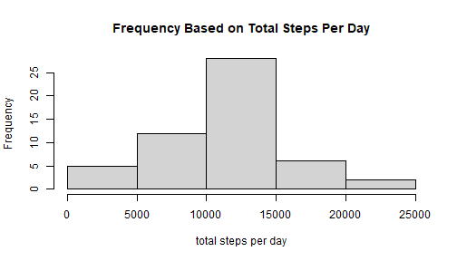
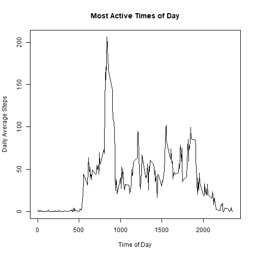
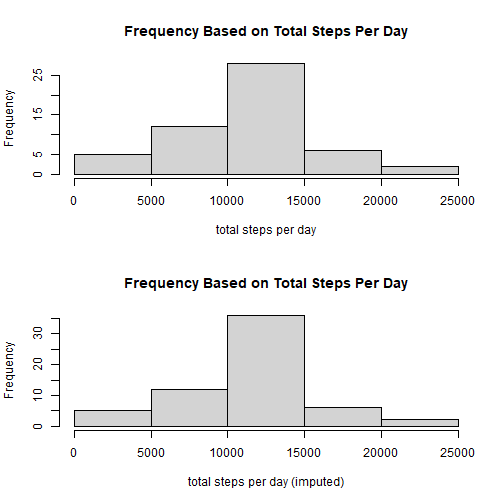
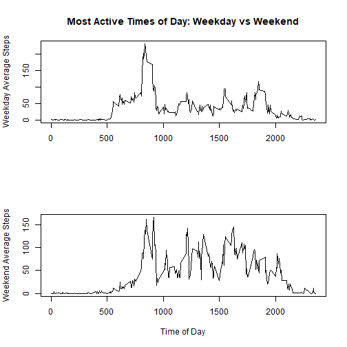

In the following document, I will be including large chunks of text to describe my intention for that section. I will also be using large chunks of code to actually run the processing/analysis of the data. There will be smaller comments within these coding blocks to aide in the understanding of the code sections. 

## Loading and preprocessing the data
A copy of the data should be contained within the repository.  
Data was obtained from: https://d396qusza40orc.cloudfront.net/repdata%2Fdata%2Factivity.zip  
Data was obtained on: "2024-02-28 08:18:16MST"  
However, if the data is not contained please run the following code:


```r
## Code has been commented out because data should be already available in the repository
## fileurl<-https://d396qusza40orc.cloudfront.net/repdata%2Fdata%2Factivity.zip
## download.file(fileurl,destfile="./activity.zip"),method="curl"
## dateDownlaoded<-date()
```

First thing I want to do is unzip the file to .csv file so that we can read it into r.


```r
zipF<-"./activity.zip"
outDir<-"./"
unzip(zipF,exdir=outDir)
```

Now we will read the data into R to see what we are working with.


```r
data<-read.csv("./activity.csv")
dim(data)
```

```
## [1] 17568     3
```

```r
str(data)
```

```
## 'data.frame':	17568 obs. of  3 variables:
##  $ steps   : int  NA NA NA NA NA NA NA NA NA NA ...
##  $ date    : chr  "2012-10-01" "2012-10-01" "2012-10-01" "2012-10-01" ...
##  $ interval: int  0 5 10 15 20 25 30 35 40 45 ...
```

```r
## Let's convert the Date into a Date format
data$date<-as.Date(as.character(data$date))
```

Looks like the data is pretty clean and workable for now as the question says that we should ignore NA values.  

## What is mean total number of steps taken per day?

The goal of this section is to calculate the total number of steps taken per day (factor based on day). Make a histogram that shows the total number of steps taken per day.  
It is clarified that we don't want a bar chart, we want a frequency histogram of the total number of steps taken per day. 
To me, this means that we want to see how many days we had say ~10000 steps. I am proceeding with the question based on these assumptions  
We should also calculate and report the mean and median of the total number steps taken per day.


```r
## Let's get rid of the NA values because they make things difficult
data1<-data[!is.na(data$steps),]
## Set the date as a factor variable so we can calculate total steps per day
data1$date<-as.factor(data1$date)
## Sum the data based on the factor using tapply
data1<-tapply(data1$steps,data1$date,FUN=sum)
## Plot a histogram showing how often we hit a certain number of steps per day
hist(data1,xlab="total steps per day",main="Frequency Based on Total Steps Per Day")
```



```r
#rug(data) 
#I love this feature but it was blocking my knit to html so I commented it out of the report
## Calculate the Mean and Median of total Steps taken per day
x<-summary(data1)
## Display the Mean steps taken per day
x[4]
```

```
##     Mean 
## 10766.19
```

```r
## Display the Median steps taken per day
x[3]
```

```
## Median 
##  10765
```


## What is the average daily activity pattern?

Now that we have a general idea of the steps per day, we want to make a time series plot of the 5-minute intervals and the aberage number of steps taken, averaged across all days. Which interval contains the most steps when averaged across all of the days. To me, this is asking to factor based on interval and make a time series plot


```r
## Let's get rid of the NA values because they make things difficult
data2<-data[!is.na(data$steps),]
## Set the interval as the factor variable so we can calculate average steps per interval
data2$interval<-as.factor(data2$interval)
## Average the steps based on the interval factor using tapply
data2<-tapply(data2$steps,data2$interval,FUN=mean)
## Create a time series plot
plot(names(data2),data2,type="l",xlab="Time of Day",ylab="Daily Average Steps",main="Most Active Times of Day")
```



```r
## Let's find the maximum average steps based on interval
x<-summary(data2)
max<-as.numeric(x[6])
int<-names(data2[data2==max])
## the interval containing the highest average daily steps
int
```

```
## [1] "835"
```

So, we can see that 8:35am is the most active time when averaged over the time period with approximately 206 steps per day in the 5 min period. 

## Imputing missing values

In this step, we need to devise a strategy to fill in the missing values in our data set. i.e if NA make a value. I like the idea of finding the mean of that interval across the time period and replacing the NA values with those values. So we need to calculate the mean values for every interval (which we did in the last section). Then we have to about replacing the values.
So we need to find the NA value, determine what the interval is and use that interval to replace the NA value.


```r
## Let's see how much missing data we have
steps<-data$steps
steps<-is.na(steps)
sum(steps)
```

```
## [1] 2304
```

```r
## 2304 missing step entries
date<-data$date
date<-is.na(date)
sum(date)
```

```
## [1] 0
```

```r
## no missing dates 
interval<-data$interval
interval<-is.na(interval)
sum(interval)
```

```
## [1] 0
```

```r
## no missing intervals great.
library(dplyr)
```

```
## 
## Attaching package: 'dplyr'
```

```
## The following objects are masked from 'package:stats':
## 
##     filter, lag
```

```
## The following objects are masked from 'package:base':
## 
##     intersect, setdiff, setequal, union
```

```r
data3<-data.frame()
for (x in names(data2)) {
  imputed<-replace(filter(data,interval==x)$steps,is.na(filter(data,interval==x)$steps),mean(filter(data,interval==x)$steps,na.rm=TRUE))
  u<-cbind(imputed,filter(data,interval==x))
  data3<-rbind(data3,u)
}
## rearrange to the original organization
data3<-arrange(data3,date,interval)
## Run the same cmparison as question 1 to find total steps per day.
data3$date<-as.factor(data3$date)
data3$imputed<-as.integer(data3$imputed)
## Sum the data based on the factor using tapply
data4<-tapply(data3$imputed,data3$date,FUN=sum)
## Plot a histogram showing how often we hit a certain number of steps per day
par(mfrow=c(2,1))
hist(data1,xlab="total steps per day",main="Frequency Based on Total Steps Per Day")
#rug(data)
hist(data4,xlab="total steps per day (imputed)",main="Frequency Based on Total Steps Per Day")
```



```r
#rug(data)
```

Here we can see that there are very little differences between our original histogram and our histogram after adding the imputed data. 


```r
## Calculate the Mean and Median of total Steps taken per day
x<-summary(data4)
## Display the Mean steps taken per day
x[4]
```

```
##     Mean 
## 10749.77
```

```r
## Display the Median steps taken per day
x[3]
```

```
## Median 
##  10641
```

As you can see, the Mean and Median are different in this scenario however, the values are quite similar. This is what we are looking for, because we don't want our imputed values to dramatically skew our data as they are estimations and not actual recordings.

## Are there differences in activity patterns between weekdays and weekends?

In this section, we would like to look into activity trends on weekdays versus weekends. We are going to be using the data set with imputed values for this section.


```r
## Let's remove the factor variable from our date column
data3$date<-as.Date(data3$date)
data3$imputed<-as.integer(data3$imputed)

## Let's create a new column that classifies the weekday using mutate
data3<-mutate(data3,weekdays(data3$date))
colnames(data3)<-c("imputed","steps","date","interval","weekday")

## Let's turn it into two factors by replacing values with either weekday or weekend, 
data3$weekday<-replace(data3$weekday,
                      data3$weekday=="Monday"|
                      data3$weekday=="Tuesday"|
                      data3$weekday=="Wednesday"|
                      data3$weekday=="Thursday"|
                      data3$weekday=="Friday",
                      "Weekday")
data3$weekday<-replace(data3$weekday,
                       data3$weekday=="Saturday"|
                       data3$weekday=="Sunday",
                       "Weekend")
data3$weekday<-as.factor(data3$weekday)

## Let's plot it. Panel plot with two time series
weekday<-filter(data3,weekday=="Weekday")
weekend<-filter(data3,weekday=="Weekend")
weekday<-tapply(weekday$imputed,weekday$interval,FUN=mean)
weekend<-tapply(weekend$imputed,weekend$interval,FUN=mean)

## Create a time series plot
par(mfrow=c(2,1))
plot(names(weekday),weekday,type="l",xlab="",ylab="Weekday Average Steps",main="Most Active Times of Day: Weekday vs Weekend")
plot(names(weekend),weekend,type="l",xlab="Time of Day",ylab="Weekend Average Steps")
```


